# AWS 3-Tier Architecture Deployment Using Terraform & GitHub Actions

## Project Workflow

```text
Developer Pushes Code to GitHub
                │
                ▼
        GitHub Actions Triggered
                │
                ▼
     Terraform Infrastructure Provisioning
                │
                ▼
        AWS Resources Created
    (VPC, Subnets, EC2, NAT, SG)
                │
                ▼
      Frontend & Backend Deployment
                │
                ▼
      Application Connected to Database
                │
                ▼
     Automatic Deployment Completed
```

---

# Infrastructure Workflow

```text
                Internet
                    │
        ┌─────────────────────┐
        │ Internet Gateway    │
        └─────────────────────┘
                    │
        ┌─────────────────────┐
        │ Public Subnet       │
        │ Bastion Host        │
        │ Frontend Server     │
        └─────────────────────┘
                    │
              NAT Gateway
                    │
        ┌─────────────────────┐
        │ Private Subnet      │
        │ Backend Server      │
        └─────────────────────┘
                    │
        ┌─────────────────────┐
        │ Database Subnet     │
        │ MySQL / RDS         │
        └─────────────────────┘
```

---

# CI/CD Workflow

```text
GitHub Repository
        │
        ▼
GitHub Actions Workflow
        │
        ├── Install Dependencies
        ├── Build Frontend
        ├── Build Backend
        ├── SSH into EC2
        ├── Deploy Application
        └── Restart Services
                │
                ▼
        AWS EC2 Instances Updated
```

---

# Screenshots

## Terraform Apply
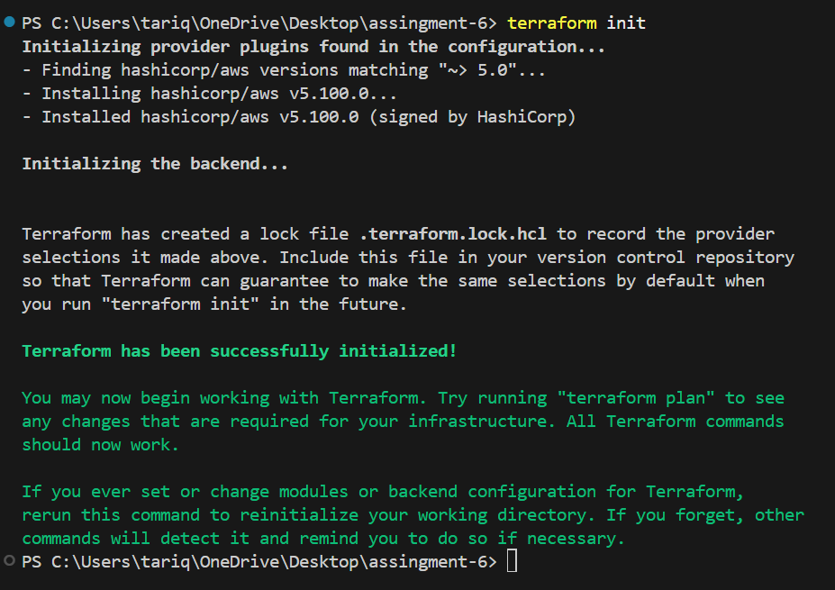
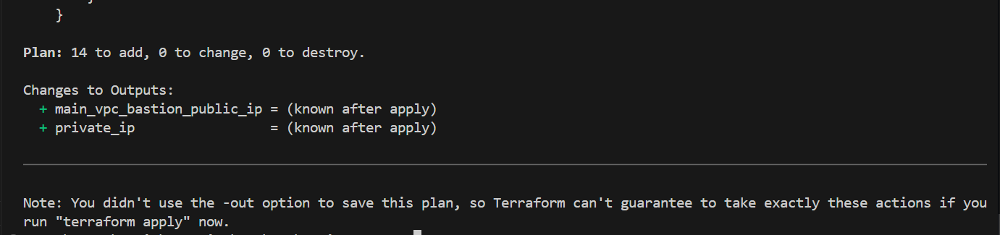
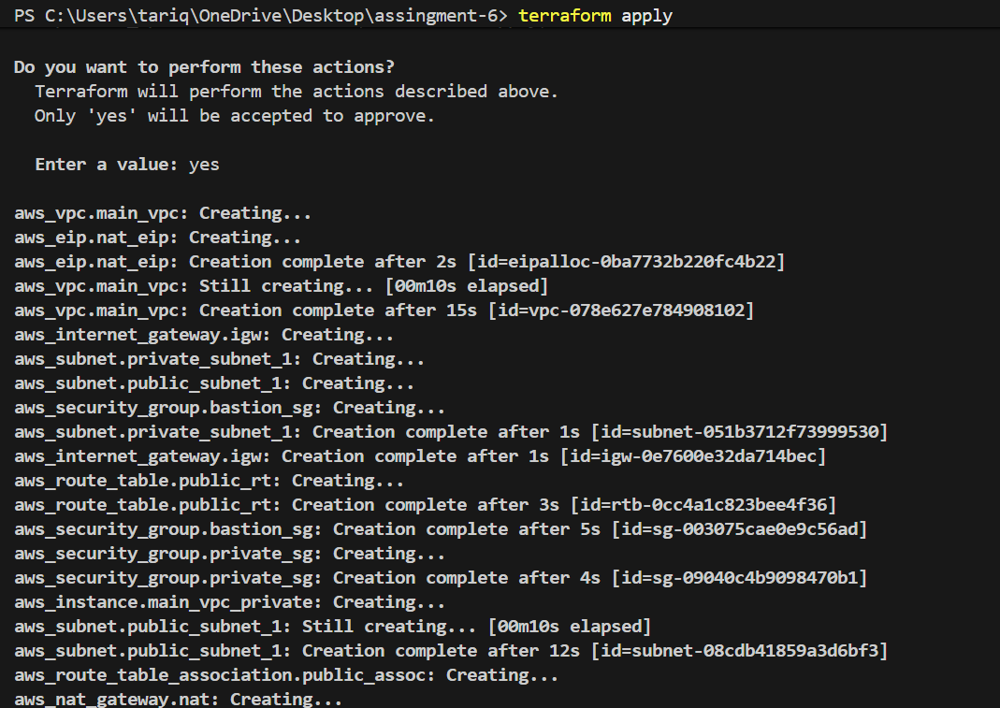
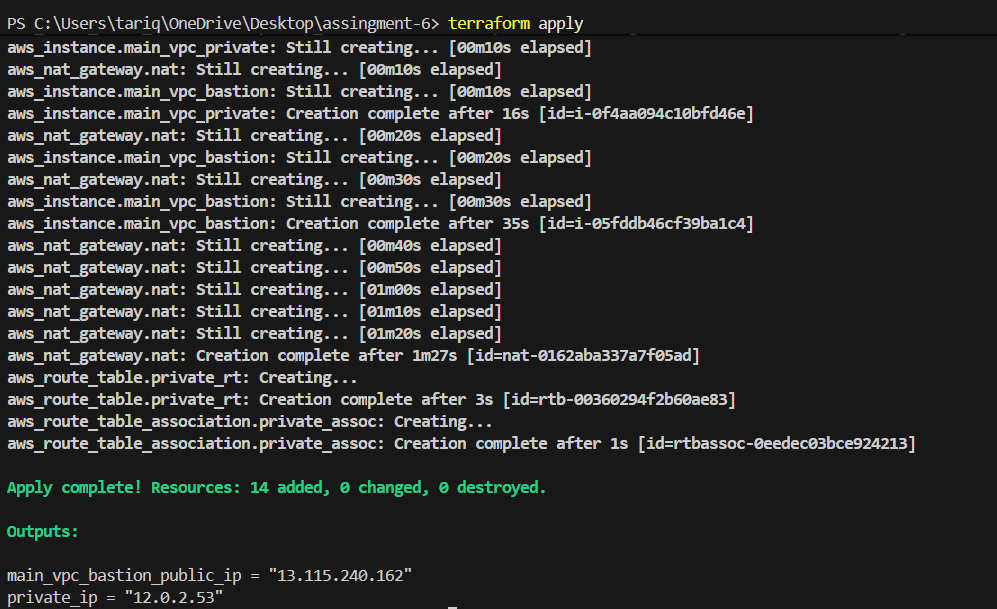
-----

## AWS VPC
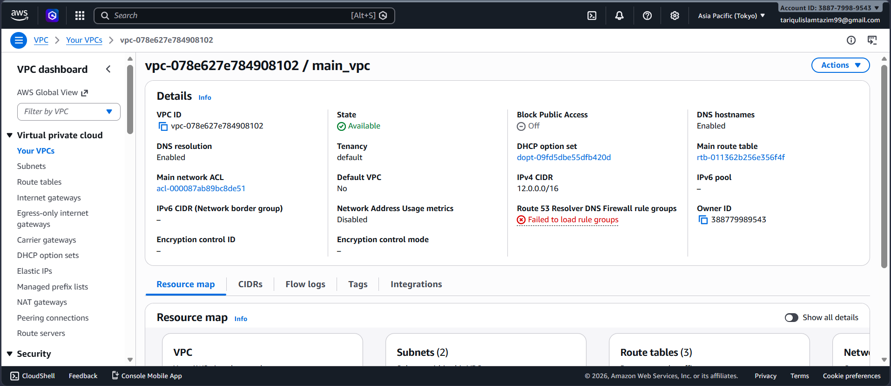

---

## Public and Private Subnets
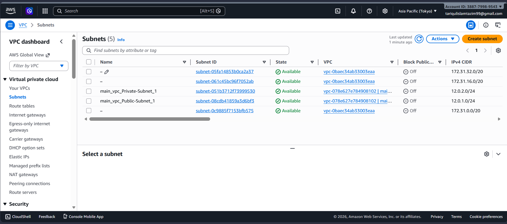

---

## EC2 Instance
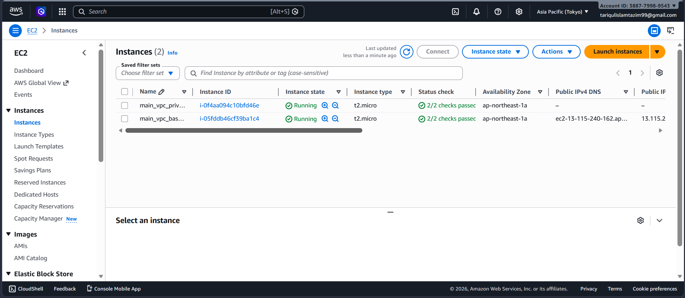

---

## Security Groups
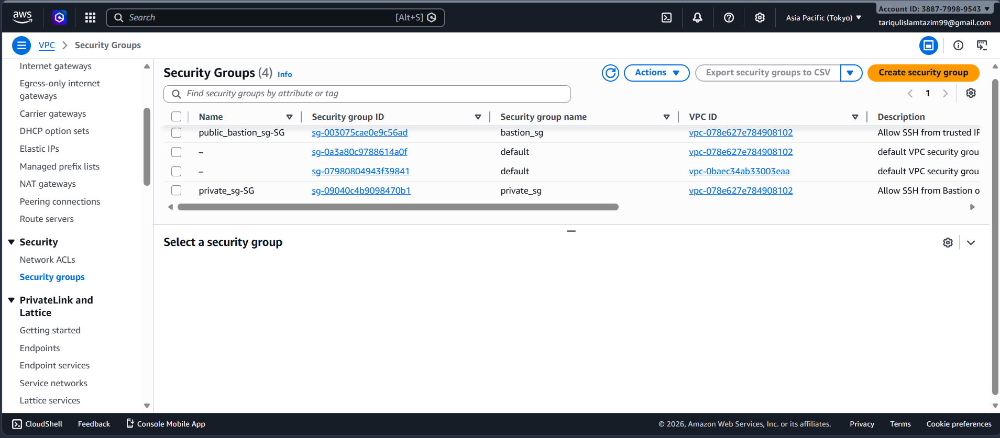

---

## Route Tables
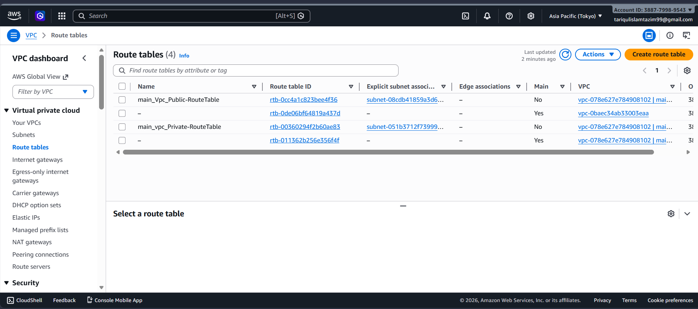

---

## Internet Gateway
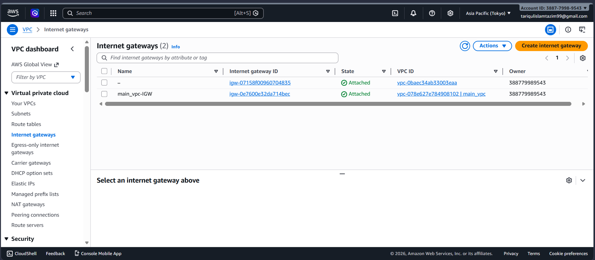

---

## NAT Gateway
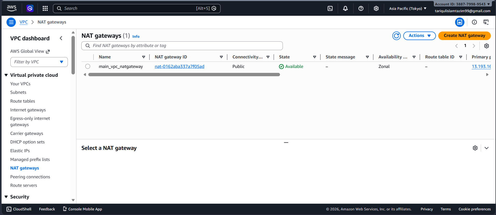

---

## Elastic IP
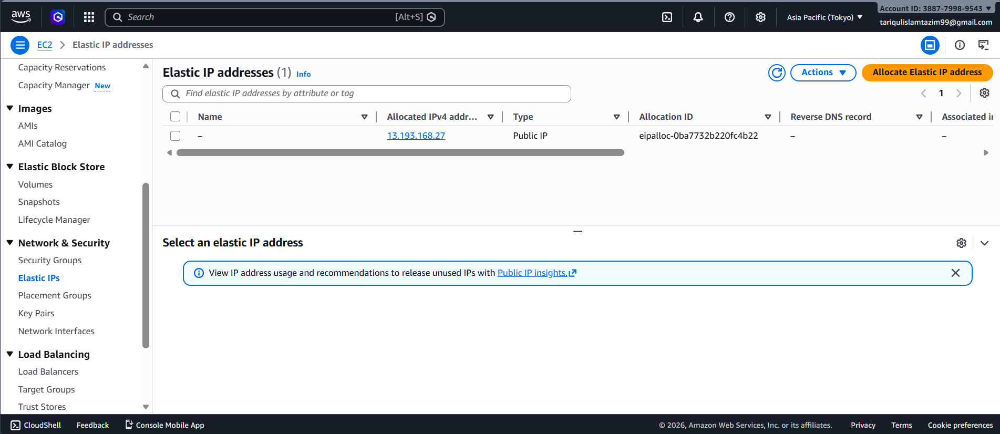

## GitHub Actions Workflow


---

## Successful CI/CD Deployment


---

## Frontend Application


---

## Backend API Response


---

## Database Connection


---

## Terraform Code


---